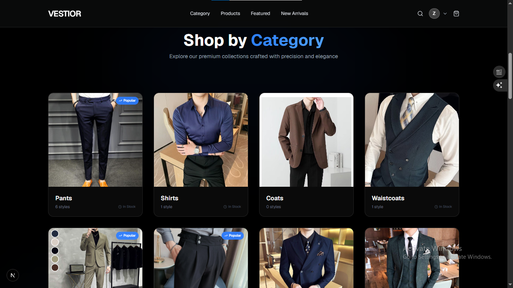
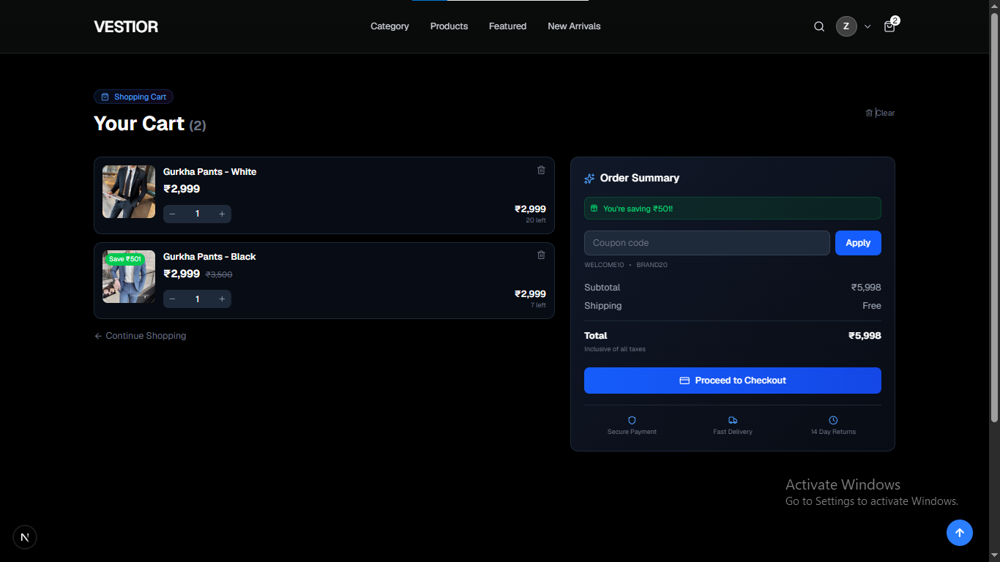
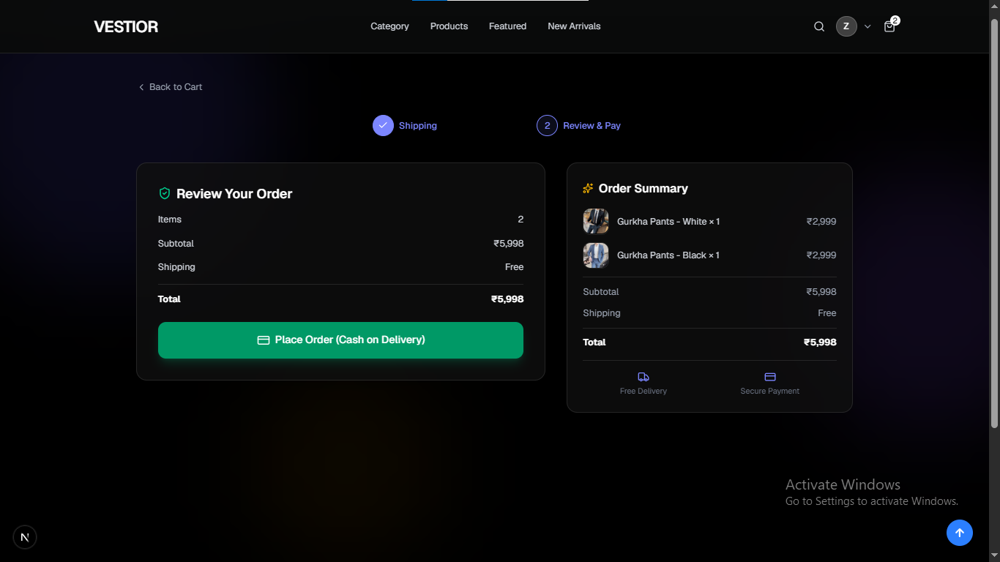
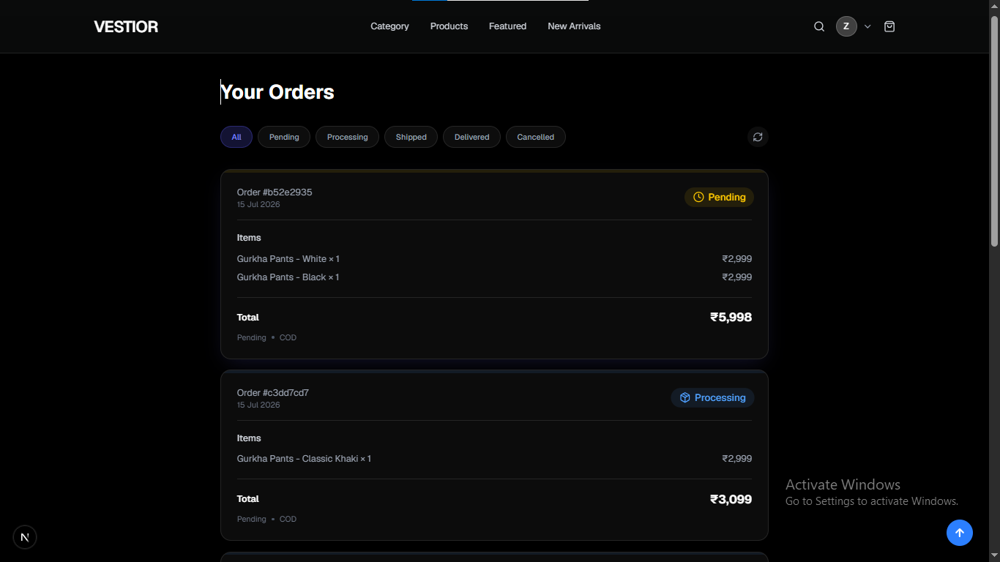
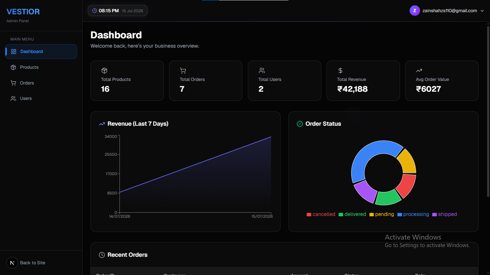
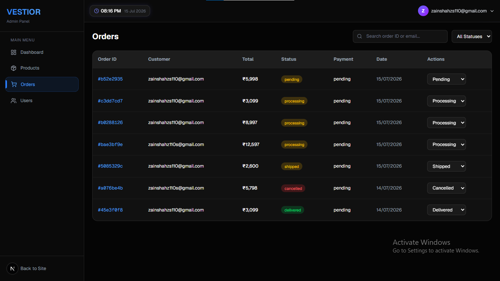
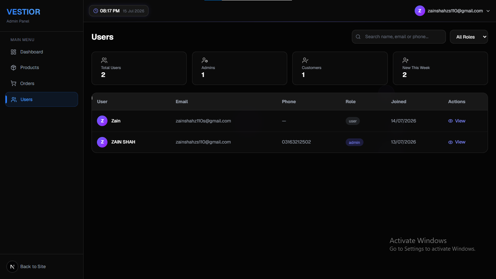

# VESTIOR — Premium Men's Fashion E‑Commerce Platform


A **full-stack, production-ready, single‑vendor e‑commerce website** for premium men’s fashion (suits, coats, pants, waistcoats, Gurkha, 2‑piece, 3‑piece). Built with Next.js 16 App Router, Supabase, Tailwind CSS v4, and Framer Motion, featuring a comprehensive admin panel, real‑time order tracking, and a modern glass‑morphism UI.

🌐 **Live Demo**: [https://vestior.vercel.app](https://vestior.vercel.app)

---

## ✨ Key Features

### 🛍️ Customer Experience
- **Elegant Homepage** – Hero section, category grid, horizontal scroll product rows
- **Advanced Product Filters** – Filter by category, search with live results
- **Product Detail** – Image gallery, size selector, stock indicator, add to cart
- **Cart & Checkout** – Local storage cart, COD checkout with address form
- **Order Tracking** – View all orders with real‑time status updates (powered by Supabase Realtime)
- **User Authentication** – Email/password + Google OAuth, email verification, custom branded emails
- **Profile Management** – Edit personal info, shipping address, phone
- **Google Analytics 4** – Page views, device/browser tracking, ready for custom events

### 🛡️ Admin Panel
- **Dashboard Analytics** – Revenue chart (last 7 days), order status donut chart, real trend percentages
- **Product Management** – Create, edit, delete products with multi‑image upload to Supabase Storage
- **Order Management** – View all orders, filter by status, update status (pending → delivered/cancelled)
- **User Management** – Table with search, role filter, detailed user modal
- **Live Clock & Glass‑morphism UI** – Modern admin interface with animated backgrounds

### ⚡ Technical Highlights
- **Full‑Stack TypeScript** – End‑to‑end type safety
- **Server Components & Actions** – Optimal data fetching, server‑side mutations
- **Row‑Level Security (RLS)** – Database‑level access control
- **Real‑time Updates** – Supabase Realtime on `orders` table for live status changes
- **Responsive Design** – Mobile, tablet, desktop
- **Custom 404 Page** – Branded fallback
- **Light/Dark Adaptive Emails** – Branded email templates that auto‑adjust to the user’s email client theme

---

## 🧰 Tech Stack

| Category            | Technology                                                      |
| ------------------- | --------------------------------------------------------------- |
| **Frontend**        | Next.js 16.2 (App Router, Turbopack), React 19, TypeScript      |
| **Styling**         | Tailwind CSS v4, Framer Motion (animations), Lucide React icons |
| **Backend & DB**    | Supabase (PostgreSQL, Auth, Storage, Realtime)                  |
| **State Management**| React Context (`AuthProvider`), localStorage (cart)             |
| **Charts**          | Recharts                                                        |
| **Notifications**   | react-hot-toast                                                 |
| **Analytics**       | Google Analytics 4 (via `next/script`)                          |
| **Deployment**      | Vercel                                                          |
| **Auth**            | Supabase Auth (email/password + Google OAuth)                   |

---

## 📸 Screenshots

| Homepage                                    | Product Category Filter                         |
| ------------------------------------------- | ----------------------------------------------- |
|                  |               |

| Product Cart                                | Checkout Page                                   |
| ------------------------------------------- | ----------------------------------------------- |
|                          |                      |

| Customer Orders                            | Admin Dashboard                                 |
| ------------------------------------------- | ----------------------------------------------- |
|                       |                    |

| Admin Orders Management                     | Admin Users Table                               |
| ------------------------------------------- | ----------------------------------------------- |
|          |       |

---

## 🚀 Getting Started

### Prerequisites
- **Node.js** v18+ and **npm** (or yarn/pnpm)
- A **Supabase** project (free tier works)
- (Optional) A **Vercel** account for deployment

🚢 Deployment
The project is deployed on Vercel. To deploy your own instance:

Push the repository to GitHub.

Import the project into Vercel.

Set the environment variables in Vercel’s project settings.

Deploy.

Make sure to configure the Supabase redirect URLs (in Authentication → URL Configuration) to include your Vercel domain for OAuth callbacks.

🗺️ Roadmap
Core e‑commerce flow (product listing → cart → checkout → orders)

Admin panel with CRUD operations

Real‑time order status updates

Google OAuth & email verification

Glass‑morphism UI & animations

Google Analytics 4 tracking

Custom branded email templates

Online payment integration (Stripe / Razorpay)

Automatic stock deduction on order placement

Admin notifications for new orders

SEO enhancements (structured data, sitemap)

Comprehensive test suite (E2E with Cypress/Playwright)

Wishlist functionality

Order detail page for customers

🤝 Contributing

Contributions are welcome! This project is built as a portfolio piece, but if you find any issues or have improvements, feel free to open an issue or pull request.

Fork the repository

Create a feature branch (git checkout -b feature/amazing-feature)

Commit your changes (git commit -m 'Add amazing feature')

Push to the branch (git push origin feature/amazing-feature)

Open a Pull Request

📄 License
This project is licensed under the MIT License. See LICENSE for details.

📞 Contact
Zain Ali Shah
Email: zainshahzs110@gmail.com
GitHub: zainshah3464
Live Project: vestior.vercel.app

<p align="center">Made with ❤️ and modern web technologies</p> ```

### 1. Clone the repository
```bash
git clone https://github.com/zainshah3464/vestior-store.git
cd vestior-store

2. Install dependencies
bash
npm install

3. Set up environment variables
Create a .env.local file in the root with:
NEXT_PUBLIC_SUPABASE_URL=https://your-project-id.supabase.co
NEXT_PUBLIC_SUPABASE_ANON_KEY=your-anon-key
SUPABASE_SERVICE_ROLE_KEY=your-service-role-key
NEXT_PUBLIC_SITE_URL=https://vestior.vercel.app  # your deployment URL
NEXT_PUBLIC_GA_MEASUREMENT_ID=G-XXXXXXXXXX       # optional – Google Analytics
Important: The SUPABASE_SERVICE_ROLE_KEY is only used on the server side and must never be exposed to the client.

4. Set up your Supabase project
Tables – Run the SQL schema (see below) in your Supabase SQL Editor to create tables and triggers.

Storage Bucket – Create a public bucket named product-images.

Authentication – Under Authentication → Providers, enable Email and Google. Configure the Google OAuth credentials.

Email Templates – (Optional) Customize the “Confirm Signup” and “Reset Password” templates with the premium VESTIOR brand (light/dark adaptive HTML provided in this repo).

RLS Policies – The schema includes basic RLS policies. Additional admin policies are handled via the service_role key.

5. Run the development server
bash
npm run dev
Open http://localhost:3000 in your browser.
🗄️ Database Schema
products
Column	Type	Description
id	uuid (PK)	Default gen_random_uuid()
name	text	Product name
description	text	Long description
price	numeric	Current price
compare_at_price	numeric	Original price (for discount)
category	text	Sub‑category (e.g., Classic Fit)
category_main	text	Main category (Pants, Shirts, etc.)
stock	int4	Available quantity
is_active	bool	Whether visible to customers
is_new_arrival	bool	New arrival badge
is_featured	bool	Featured product badge
images	text	JSON array of image URLs (stored as string)
created_at	timestamptz	
updated_at	timestamptz	
orders
Column	Type	Description
id	uuid (PK)	
user_id	uuid (FK)	References auth.users.id
user_email	text	
items	jsonb	Array of {product_id, product_name, qty, price}
address	jsonb	Shipping address object
subtotal	int4	
shipping	int4	
total	int4	
status	text	pending, processing, shipped, delivered, cancelled
payment_status	text	pending, completed (default: pending)
payment_method	text	cod, etc.
created_at	timestamptz	
order_items
Column	Type	Description
id	uuid (PK)	
order_id	uuid (FK)	References orders.id
product_id	uuid (FK)	References products.id
product_name	text	
quantity	int4	
price	numeric	
created_at	timestamptz	
profiles
Column	Type	Description
id	uuid (PK)	Matches auth.users.id
full_name	text	
email	text	Unique
phone	text	
role	text	customer or admin (default: customer)
address_line1	text	
address_line2	text	
city	text	
state	text	
pincode	text	
created_at	timestamptz	
updated_at	timestamptz	
Triggers & Functions
handle_new_user() – Automatically inserts a row into profiles after a new user signs up (id, full_name, email).

Storage
Bucket: product-images – Public, used for product images. Folder naming: {timestamp}-{filename}.jpg.

Realtime
orders table has realtime enabled for live status updates on the customer frontend.
📁 Folder Structure
src/
├── app/
│   ├── (main)/               # Customer-facing pages
│   │   ├── page.tsx          # Homepage
│   │   ├── products/         # Product listing & detail
│   │   ├── category/[slug]   # Category filter
│   │   ├── cart/             # Cart page
│   │   ├── checkout/         # Checkout (COD)
│   │   ├── orders/           # User orders (real-time)
│   │   ├── profile/          # User profile
│   │   ├── featured/         # Featured products
│   │   ├── new-arrivals/     # New arrivals
│   │   └── auth/             # Login, signup, OAuth callback
│   ├── admin/                # Admin panel
│   │   ├── page.tsx          # Dashboard (server component)
│   │   ├── products/         # Product CRUD
│   │   ├── orders/           # Order management
│   │   └── users/            # User table + modal
│   ├── layout.tsx            # Root layout (providers, toaster)
│   ├── not-found.tsx         # Custom 404
│   └── globals.css           # Tailwind imports, animations
├── components/               # Shared UI components
│   ├── admin/                # Admin-specific components
│   └── ...                   # Navbar, Footer, ProductCard, etc.
├── lib/                      # Supabase clients & utils
│   ├── supabase/
│   │   ├── client.ts         # Browser client
│   │   ├── server.ts         # Server client (cookies)
│   │   └── admin.ts          # Admin client (service_role)
│   └── utils.ts              # parseProductImages helper
├── providers/
│   └── AuthProvider.tsx      # Auth context
├── actions/
│   └── updateOrderStatus.ts  # Server action for admin
└── middleware.ts              # Route protection & admin check

🛠️ Environment Variables
Variable	Description
NEXT_PUBLIC_SUPABASE_URL	Supabase project URL (public)
NEXT_PUBLIC_SUPABASE_ANON_KEY	Supabase anonymous key (public)
SUPABASE_SERVICE_ROLE_KEY	Supabase service role key (secret, server‑only)
NEXT_PUBLIC_SITE_URL	Your deployment URL (for Open Graph & callbacks)
NEXT_PUBLIC_GA_MEASUREMENT_ID	Google Analytics 4 measurement ID (optional)
Note: Never expose SUPABASE_SERVICE_ROLE_KEY to the browser. It’s used only in server components and server actions.
