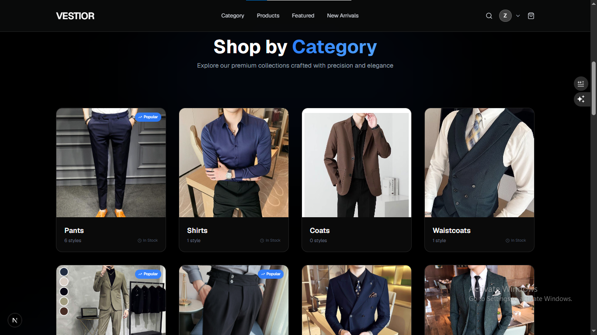
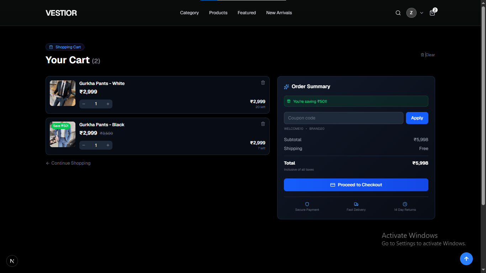
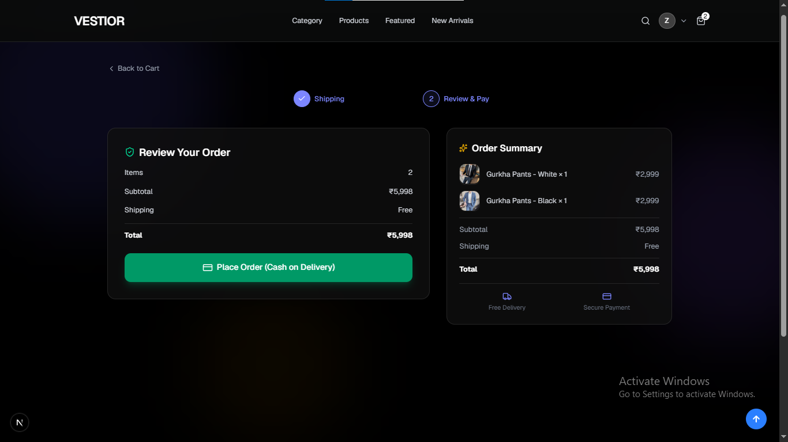
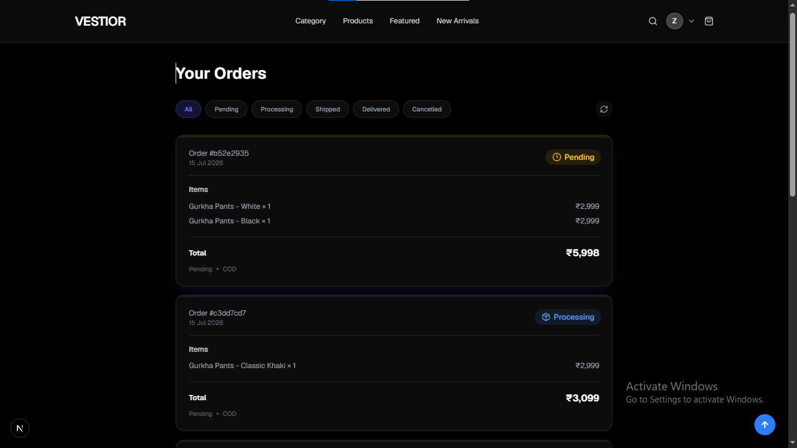
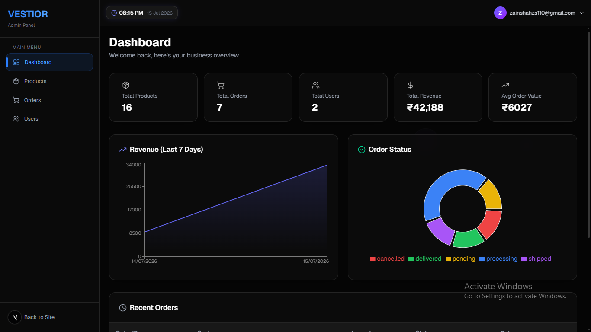
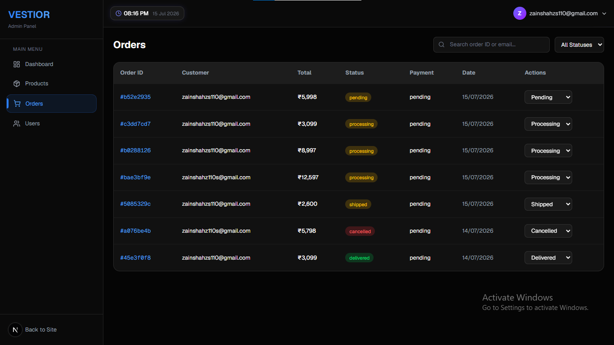
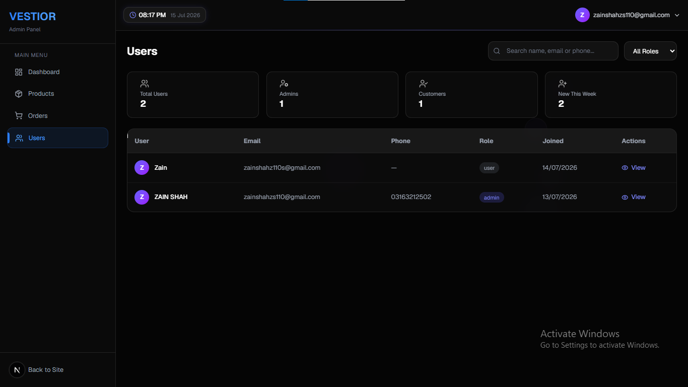

# VESTIOR — Premium Men's Fashion E‑Commerce Platform

[](https://nextjs.org)
[](https://react.dev)
[](https://www.typescriptlang.org)
[](https://tailwindcss.com)
[](https://supabase.com)
[](https://upstash.com)
[](https://vercel.com)

[](#-lighthouse-scores)
[](#-lighthouse-scores)
[](#-lighthouse-scores)
[](#-lighthouse-scores)

A **production-ready, single-vendor e-commerce platform** for premium men's fashion (suits, coats, pants, waistcoats, Gurkha, 2-piece, 3-piece sets). Built with **Next.js 16 App Router**, **Supabase** (PostgreSQL + Auth + Storage + Realtime), **Tailwind CSS v4**, and **Framer Motion** — featuring a comprehensive admin panel, real-time order tracking, atomic transactional checkout, and enterprise-grade security.

🌐 **Live Demo**: [https://vestior.vercel.app](https://vestior.vercel.app)

---

## 📋 Table of Contents

- [🏆 Lighthouse Scores](#-lighthouse-scores)
- [✨ Key Features](#-key-features)
- [🧰 Tech Stack](#-tech-stack)
- [📸 Screenshots](#-screenshots)
- [🏗️ Architecture](#️-architecture)
- [🚀 Getting Started](#-getting-started)
  - [Prerequisites](#prerequisites)
  - [Installation](#1-clone--install)
  - [Environment Variables](#2-environment-variables)
  - [Supabase Setup](#3-supabase-setup)
  - [Run Development Server](#4-run-development-server)
- [👤 How to Create First Admin](#-how-to-create-first-admin)
- [🌱 Seed Data](#-seed-data)
- [📁 Project Structure](#-project-structure)
- [🔐 Security Checklist](#-security-checklist)
- [🔌 Server Actions API](#-server-actions-api)
- [📊 Database Schema](#-database-schema)
- [📡 Performance & SEO](#-performance--seo)
- [🧪 Testing (Manual QA)](#-testing-manual-qa)
- [🐛 Troubleshooting](#-troubleshooting)
- [🌐 Browser Support](#-browser-support)
- [♿ Accessibility Notes](#-accessibility-notes)
- [❓ FAQ](#-faq)
- [🗺️ Roadmap](#️-roadmap)
- [📅 Changelog](#-changelog)
- [🛡️ Security Disclosure](#️-security-disclosure)
- [🚢 Deployment](#-deployment)
- [🤝 Contributing](#-contributing)
- [📄 License](#-license)
- [📞 Contact](#-contact)

---

## 🏆 Lighthouse Scores

| Performance | Accessibility | Best Practices | SEO |
| :---------: | :-----------: | :------------: | :-: |
|   **87**    |    **85**     |    **100**     | **100** |

> Audited with Google Lighthouse (mobile emulation, production build).

**What's included:**
- ✅ Production build (Turbopack)
- ✅ Lazy-loaded images and dynamic chart chunks
- ✅ Optimized Hero imagery (WebP + JPEG fallback)
- ✅ JSON-LD structured data
- ✅ Semantic HTML with ARIA labels

---

## ✨ Key Features

### 🛍️ Customer Experience
- **Elegant Homepage** — Hero section with adaptive imagery, category grid, horizontal scroll product rows
- **Advanced Product Discovery** — Category filters, debounced live search with recent history
- **Product Detail** — Multi-image gallery, size selector, live stock indicator, dynamic OG metadata
- **Cart & Checkout** — localStorage cart with deduplication, secure server-validated checkout
- **Order Tracking** — Real-time status updates via Supabase Realtime channels
- **Authentication** — Email/password + Google OAuth, email verification, PKCE-safe callback handling
- **Profile Management** — Personal info, shipping address, phone with RLS-enforced ownership
- **Google Analytics 4** — Page views, route-change tracking, ready for custom events

### 🛡️ Admin Panel
- **Dashboard Analytics** — Server-aggregated revenue chart, status distribution, trend deltas (single RPC call)
- **Product Management** — Full CRUD with multi-image upload to Supabase Storage
- **Order Management** — Filter by status, atomic status transitions with authorization checks
- **User Management** — Searchable table with role filter and detailed user modal
- **Live Clock & Glass-morphism UI** — Modern dark UI with animated backgrounds

### ⚡ Technical Highlights

| Category | Implementation |
|----------|----------------|
| **Security** | Row-Level Security (RLS) on every table, `SECURITY DEFINER` helper functions, service-role isolation, `import 'server-only'` guards |
| **Data Integrity** | Atomic PostgreSQL RPC for order placement + stock deduction (`FOR UPDATE` locks, deadlock-safe ordering) |
| **Authorization** | Server-side admin verification in every privileged Server Action — zero trust in client state |
| **Rate Limiting** | Upstash Redis sliding-window limiters per route tier (auth / admin / orders / general) with fail-open behavior |
| **Session Management** | `@supabase/ssr` with cookie-preserving middleware, PKCE OAuth flow, singleton browser client |
| **Performance** | Server Components by default, `Promise.all` parallel data fetching, dynamic imports for heavy charts, lazy image loading, selective column selection |
| **SEO** | Dynamic `robots.txt`, auto-generated `sitemap.xml`, JSON-LD structured data (Organization, Product, Breadcrumb), per-page metadata |
| **Error Handling** | Global error boundary, route-level loading states, env validation |
| **Type Safety** | End-to-end TypeScript with strict mode |

---

## 🧰 Tech Stack

| Layer | Technology |
|-------|-----------|
| **Framework** | Next.js 16.3 (App Router, Turbopack), React 19.3 |
| **Language** | TypeScript 5 (strict) |
| **Styling** | Tailwind CSS v4, Framer Motion, Lucide Icons |
| **Backend & DB** | Supabase (PostgreSQL, Auth, Storage, Realtime) |
| **Rate Limiting** | Upstash Redis + `@upstash/ratelimit` |
| **State Management** | React Context (auth), localStorage (cart) |
| **Data Visualization** | Recharts (dynamically loaded) |
| **Notifications** | react-hot-toast |
| **Analytics** | Google Analytics 4 |
| **Deployment** | Vercel |

---

## 📸 Screenshots

| Homepage | Product Category |
|:--------:|:----------------:|
|  |  |

| Cart | Checkout |
|:----:|:--------:|
|  |  |

| Customer Orders | Admin Dashboard |
|:---------------:|:---------------:|
|  |  |

| Admin Orders | Admin Users |
|:------------:|:-----------:|
|  |  |

---

## 🏗️ Architecture

### Security Model

```
┌─────────────────────────────────────────────────────────────┐
│                      Browser (Untrusted)                    │
├─────────────────────────────────────────────────────────────┤
│  • Supabase JS client (singleton)                           │
│  • Cart state in localStorage (never trusted for pricing)   │
│  • All mutations via Server Actions                         │
└──────────────────────────┬──────────────────────────────────┘
                           │
                           ▼
┌─────────────────────────────────────────────────────────────┐
│         Next.js Middleware (proxy.ts) — Edge                │
├─────────────────────────────────────────────────────────────┤
│  • Rate limiting (Upstash Redis)                            │
│  • Session refresh (cookie-preserving)                      │
│  • Route guards (/admin requires role='admin')              │
└──────────────────────────┬──────────────────────────────────┘
                           │
                           ▼
┌─────────────────────────────────────────────────────────────┐
│              Server Actions & RSC — Node.js                 │
├─────────────────────────────────────────────────────────────┤
│  • Re-authenticate every privileged action                  │
│  • Validate all input server-side                           │
│  • Fetch authoritative data from DB (never trust client)    │
└──────────────────────────┬──────────────────────────────────┘
                           │
                           ▼
┌─────────────────────────────────────────────────────────────┐
│         Supabase (PostgreSQL + RLS) — Source of Truth       │
├─────────────────────────────────────────────────────────────┤
│  • Row-Level Security on every table                        │
│  • Atomic RPC functions for multi-step transactions         │
│  • Service-role key isolated to server only                 │
└─────────────────────────────────────────────────────────────┘
```

### Order Placement Flow (Atomic)

```
Customer clicks "Place Order"
         │
         ▼
Server Action: placeOrder(items, address)
         │
         ▼
 1. Authenticate caller (getUser)
 2. Validate input shape (item count, quantities, address)
 3. Merge duplicate product_id entries
 4. Call RPC: place_order_atomic(...)
         │
         ▼
PostgreSQL Transaction:
  ┌──────────────────────────────────────────┐
  │  BEGIN                                   │
  │  FOR each product (ordered by id):       │
  │    • SELECT ... FOR UPDATE (row lock)    │
  │    • Verify is_active + stock >= qty     │
  │    • Accumulate subtotal                 │
  │    • UPDATE stock = stock - qty          │
  │                                          │
  │  INSERT INTO orders (...)                │
  │  INSERT INTO order_items (...)           │
  │  COMMIT                                  │
  └──────────────────────────────────────────┘
         │
         ▼
  Revalidate cached routes
  Return orderId + authoritative total
```

**Concurrency guarantee:** Under simultaneous orders on the same product, `FOR UPDATE` serializes access. Oversell is impossible.

---

## 🚀 Getting Started

### Prerequisites

- **Node.js** v20+
- **npm** (or pnpm/yarn)
- **Supabase** project ([free tier](https://supabase.com))
- **Upstash** Redis database ([free tier](https://upstash.com)) — for rate limiting

### 1. Clone & Install

```bash
git clone https://github.com/zainshah3464/vestior-store.git
cd vestior-store
npm install
```

### 2. Environment Variables

Copy `.env.example` to `.env.local` and fill in:

```env
# Supabase
NEXT_PUBLIC_SUPABASE_URL=https://your-project-id.supabase.co
NEXT_PUBLIC_SUPABASE_ANON_KEY=eyJhbGciOi...
SUPABASE_SERVICE_ROLE_KEY=eyJhbGciOi...   # ⚠️ Server-only

# Site
NEXT_PUBLIC_SITE_URL=http://localhost:3000

# Upstash Rate Limiting
UPSTASH_REDIS_REST_URL=https://xxxxx.upstash.io
UPSTASH_REDIS_REST_TOKEN=AXxxxx...

# Google Analytics (optional)
NEXT_PUBLIC_GA_MEASUREMENT_ID=G-XXXXXXXXXX
```

> ⚠️ **Never** expose `SUPABASE_SERVICE_ROLE_KEY` to the browser. It bypasses RLS.

### 3. Supabase Setup

#### 3a. Database Schema

Run in Supabase SQL Editor:

**Tables**

```sql
-- Products
create table public.products (
  id uuid primary key default gen_random_uuid(),
  name text not null,
  description text,
  price numeric not null,
  compare_at_price numeric,
  category text,
  category_main text,
  stock int4 default 0,
  is_active bool default true,
  is_new_arrival bool default false,
  is_featured bool default false,
  images text default '[]',
  created_at timestamptz default now(),
  updated_at timestamptz default now()
);

-- Orders
create table public.orders (
  id uuid primary key default gen_random_uuid(),
  user_id uuid references auth.users(id) not null,
  user_email text not null,
  items jsonb not null,
  address jsonb not null,
  subtotal int4 not null,
  shipping int4 not null,
  total int4 not null,
  status text default 'pending',
  payment_status text default 'pending',
  payment_method text default 'cod',
  created_at timestamptz default now()
);

-- Order items
create table public.order_items (
  id uuid primary key default gen_random_uuid(),
  order_id uuid references public.orders(id) on delete cascade not null,
  product_id uuid references public.products(id) not null,
  product_name text not null,
  quantity int4 not null,
  price numeric not null,
  created_at timestamptz default now()
);

-- Profiles
create table public.profiles (
  id uuid primary key references auth.users(id) on delete cascade,
  full_name text,
  email text unique,
  phone text,
  role text default 'customer',
  address_line1 text,
  address_line2 text,
  city text,
  state text,
  pincode text,
  created_at timestamptz default now(),
  updated_at timestamptz default now()
);
```

**Triggers, Functions & RLS**

See [`supabase/migrations/`](./supabase/migrations) for the full set of SQL migrations, including:

- `handle_new_user()` trigger — auto-creates profile on signup
- `is_admin()` helper — RLS-safe admin check
- `place_order_atomic()` — transactional order + stock deduction
- `get_dashboard_stats()` — single-query admin aggregation
- Full RLS policies for `products`, `orders`, `order_items`, `profiles`
- Performance indexes on hot query paths

#### 3b. Storage

Create a **public** bucket named `product-images`.

#### 3c. Authentication

- Enable **Email** and **Google** providers
- Configure Google OAuth credentials
- Under **URL Configuration**, add:
  - Site URL: `http://localhost:3000` (dev) / your Vercel domain (prod)
  - Redirect URLs: `http://localhost:3000/auth/callback`, `https://your-domain.vercel.app/auth/callback`

### 4. Run Development Server

```bash
npm run dev
```

Open [http://localhost:3000](http://localhost:3000).

---

## 👤 How to Create First Admin

There's **no self-serve admin signup** for security reasons. To promote a user to admin:

### Method 1 — Supabase Dashboard (Recommended)

1. **Sign up normally** via `/auth/signup` (verify email)
2. Open **Supabase Dashboard** → **Table Editor** → `profiles`
3. Find your user row
4. Change `role` column value from `customer` to `admin`
5. Save

### Method 2 — SQL Editor

```sql
UPDATE public.profiles
SET role = 'admin'
WHERE email = 'your-email@example.com';
```

Now navigate to `/admin` — access granted.

### Verify Access Control

- **Logged-out users** → redirected to `/auth/login`
- **Logged-in customers** → redirected to `/` (homepage)
- **Admins** → full access ✅

---

## 🌱 Seed Data

Populate your store with demo products. Run in Supabase SQL Editor:

```sql
INSERT INTO public.products
  (name, description, price, compare_at_price, category, category_main, stock, is_active, is_new_arrival, is_featured, images)
VALUES
  (
    'Charcoal Overcoat',
    'Tailored wool-blend overcoat with notch lapels — a timeless winter essential.',
    18999, 23999, 'Overcoats', 'Coats', 15, true, true, true,
    '["https://placehold.co/800x800/1a1a1a/3B82F6?text=Overcoat"]'
  ),
  (
    'Classic Navy Suit',
    'Two-piece slim-fit suit in Italian wool. Perfect for the modern professional.',
    24999, 29999, 'Two Piece', '2 Piece', 10, true, false, true,
    '["https://placehold.co/800x800/1a1a1a/3B82F6?text=Navy+Suit"]'
  ),
  (
    'Khaki Twill Shirt',
    'Premium cotton twill shirt with mother-of-pearl buttons.',
    3999, 4999, 'Casual', 'Shirts', 50, true, true, false,
    '["https://placehold.co/800x800/1a1a1a/3B82F6?text=Khaki+Shirt"]'
  ),
  (
    'Olive Green Chinos',
    'Slim-fit stretch chinos in a rich olive tone.',
    4599, 5999, 'Slim Fit', 'Pants', 40, true, false, true,
    '["https://placehold.co/800x800/1a1a1a/3B82F6?text=Chinos"]'
  ),
  (
    'Heritage Gurkha Pants',
    'High-waisted Gurkha trousers with side adjusters — a wardrobe statement.',
    7999, 9999, 'Gurkha', 'Gurkha', 25, true, true, true,
    '["https://placehold.co/800x800/1a1a1a/3B82F6?text=Gurkha"]'
  );
```

Then replace image URLs with real product photos via the admin panel.

---

## 📁 Project Structure

```
src/
├── app/
│   ├── (main)/                    # Customer-facing pages
│   │   ├── page.tsx               # Homepage
│   │   ├── products/              # Listing + dynamic detail
│   │   ├── category/[slug]/       # Category filter
│   │   ├── cart/                  # Cart with dedup logic
│   │   ├── checkout/              # Server-validated checkout
│   │   ├── orders/                # Realtime order tracking
│   │   ├── profile/               # User profile
│   │   ├── featured/              # Featured collection
│   │   ├── new-arrivals/          # New arrivals
│   │   └── auth/                  # Login, signup, callback, verify-email
│   ├── admin/                     # Admin panel
│   │   ├── page.tsx               # Dashboard (single RPC)
│   │   ├── products/              # Product CRUD
│   │   ├── orders/                # Order management
│   │   └── users/                 # User table + modal
│   ├── layout.tsx                 # Root layout + structured data
│   ├── error.tsx                  # Global error boundary
│   ├── loading.tsx                # Global loading state
│   ├── not-found.tsx              # Custom 404
│   ├── robots.ts                  # Dynamic robots.txt
│   ├── sitemap.ts                 # Dynamic sitemap.xml
│   └── globals.css                # Tailwind + animations
├── components/
│   ├── admin/                     # Admin-specific UI
│   ├── StructuredData.tsx         # JSON-LD schemas
│   └── ...                        # Navbar, Footer, ProductCard, Hero, etc.
├── lib/
│   ├── supabase/
│   │   ├── client.ts              # Browser singleton client
│   │   ├── server.ts              # Server client (cookies)
│   │   └── admin.ts               # Service-role (server-only)
│   ├── ratelimit.ts               # Upstash limiters
│   ├── env.ts                     # Env validation
│   └── utils.ts                   # Shared helpers
├── providers/
│   └── AuthProvider.tsx           # Auth context
├── actions/
│   ├── placeOrder.ts              # Atomic order action
│   └── updateOrderStatus.ts       # Admin order status (authorized)
└── proxy.ts                       # Next.js 16 middleware
```

---

## 🔐 Security Checklist

- [x] **RLS enabled** on all tables (`products`, `orders`, `order_items`, `profiles`)
- [x] **Zero trust in client pricing** — all totals computed server-side from DB
- [x] **Atomic transactions** for order placement (no partial state)
- [x] **`FOR UPDATE` locks** prevent oversell under concurrency
- [x] **Every admin Server Action** re-verifies role server-side
- [x] **Service-role key** never reaches the browser (`import 'server-only'`)
- [x] **PKCE OAuth** flow with cookie-preserving callback
- [x] **Open redirect** protection on `next` param
- [x] **Rate limiting** per route tier (auth / admin / orders / general)
- [x] **Fail-open** rate limiter (site stays up if Redis is down)
- [x] **Environment variables** validated at startup
- [x] **Session refresh** with cookie preservation on redirects

---

## 🔌 Server Actions API

All privileged operations go through Server Actions with strict authorization.

| Action | File | Auth Required | Purpose |
|--------|------|---------------|---------|
| `placeOrder(items, address)` | `src/actions/placeOrder.ts` | Authenticated user | Validates cart, fetches DB prices, calls `place_order_atomic` RPC. Rejects client-supplied prices. |
| `updateOrderStatus(orderId, status)` | `src/actions/updateOrderStatus.ts` | Admin only | Whitelisted status values, verifies caller role, updates order, revalidates admin + customer routes. |

### Server Action Guarantees

- **Never trust client input** — every argument is re-validated server-side
- **Re-authenticate on every call** — Next.js Server Actions are public POST endpoints
- **Authorize against DB state** — role checks against `profiles` table, not JWT claims
- **Fail closed on error** — thrown errors surface as toasts on the client

---

## 📊 Database Schema

### `products`
| Column | Type | Notes |
|--------|------|-------|
| `id` | `uuid` | PK, `gen_random_uuid()` |
| `name` | `text` | |
| `description` | `text` | |
| `price` | `numeric` | In PKR |
| `compare_at_price` | `numeric` | For discount display |
| `category` | `text` | Sub-category |
| `category_main` | `text` | Main category |
| `stock` | `int4` | Decremented atomically on order |
| `is_active` | `bool` | Storefront visibility |
| `is_new_arrival` | `bool` | Badge |
| `is_featured` | `bool` | Homepage highlight |
| `images` | `text` | JSON array of URLs |
| `created_at` / `updated_at` | `timestamptz` | |

### `orders`
| Column | Type | Notes |
|--------|------|-------|
| `id` | `uuid` | PK |
| `user_id` | `uuid` | FK → `auth.users.id` |
| `user_email` | `text` | |
| `items` | `jsonb` | Snapshot at order time |
| `address` | `jsonb` | Shipping address |
| `subtotal`, `shipping`, `total` | `int4` | Server-calculated |
| `status` | `text` | `pending` / `processing` / `shipped` / `delivered` / `cancelled` |
| `payment_status` | `text` | `pending` / `completed` |
| `payment_method` | `text` | `cod` (extensible) |

### `order_items`
Denormalized snapshot with FK to `orders` and `products`.

### `profiles`
Extends `auth.users` — matches `id`, adds `role` (`customer` / `admin`), contact info, and shipping address.

---

## 📡 Performance & SEO

- **Dynamic `robots.txt`** — Blocks admin/checkout from crawlers
- **Auto-generated `sitemap.xml`** — Includes products, categories, static pages (revalidates hourly)
- **JSON-LD** — Organization, WebSite, Product, Breadcrumb schemas
- **Per-page metadata** — Dynamic OG + Twitter cards for products and categories
- **Canonical URLs** — Every dynamic route declares its canonical
- **Lazy-loaded recharts** — Admin charts in a separate chunk
- **Singleton Supabase client** — One WebSocket, no refresh races
- **Promise.all** — Parallel data fetching on Homepage and Admin Dashboard

**Bundle optimization:**
- Hero image: **1.9MB → ~300KB** (WebP, with JPEG fallback)
- `react-icons` removed (migrated to Lucide)
- Recharts loaded only on admin dashboard

---

## 🧪 Testing (Manual QA)

Testing is currently **manual**. Automated E2E suite is on the roadmap.

### Test Accounts

| Role | Email | Password |
|------|-------|----------|
| Admin | `admin@test.com` | `Test@123` |
| Customer | `user@test.com` | `Test@123` |

> ⚠️ **Create your own test accounts.** Above are suggested credentials for local testing.

### Customer Flow Tests

- [ ] Signup with email → verification email received
- [ ] Verify email → login successful
- [ ] Google OAuth login (existing Google account)
- [ ] Browse products → filter by category
- [ ] Live search returns matching products
- [ ] Add to cart → refresh → cart persists
- [ ] Update quantity → totals recalculate
- [ ] Remove item → cart updates
- [ ] Checkout with COD → order appears in `/orders`
- [ ] Order status changes propagate in real-time (admin → customer)
- [ ] Profile update saves successfully
- [ ] Logout clears session

### Admin Flow Tests

- [ ] `/admin` access with admin account
- [ ] `/admin` access **denied** for customer account (redirect to `/`)
- [ ] `/admin` access **denied** when logged out (redirect to `/auth/login`)
- [ ] Create product with multi-image upload
- [ ] Edit product → changes persist
- [ ] Delete product → removed from storefront
- [ ] Filter orders by status
- [ ] Update order status (pending → shipped → delivered)
- [ ] User table search and role filter
- [ ] Dashboard stats match DB counts

### Edge Cases

- [ ] Out-of-stock product → add to cart → checkout shows "Insufficient stock"
- [ ] Concurrent orders (two tabs, same product, stock=1) → only one succeeds
- [ ] Manipulated `localStorage.cart` prices → server rejects, uses DB prices
- [ ] Rate limit trigger: 15 rapid `/auth/login` → 429 after 10
- [ ] Session expiry: refresh page after 1h idle → still logged in (if refresh token valid)
- [ ] Open redirect: `/auth/callback?next=https://evil.com` → redirects to `/`, not `evil.com`
- [ ] Anonymous Supabase delete on `products` → blocked by RLS
- [ ] Anonymous Supabase update on `orders` → blocked by RLS

### Security Regression Tests

- [ ] Non-admin user cannot invoke `updateOrderStatus` (server rejects)
- [ ] Non-authenticated user cannot invoke `placeOrder`
- [ ] Product DELETE via anon client → RLS error
- [ ] Order UPDATE via anon client → RLS error
- [ ] Direct RPC calls to `place_order_atomic` from anon client → permission denied

---

## 🐛 Troubleshooting

### Google OAuth fails or redirects to login
- **Cause:** Redirect URL not whitelisted in Supabase
- **Fix:** Supabase → Authentication → URL Configuration → add both dev and prod callback URLs:
  - `http://localhost:3000/auth/callback`
  - `https://your-domain.vercel.app/auth/callback`

### Images not loading (broken image icons)
- **Cause:** Storage bucket not public, or remote pattern missing in `next.config.ts`
- **Fix:**
  - Supabase → Storage → `product-images` bucket → set **Public**
  - `next.config.ts` → add hostname to `images.remotePatterns`

### `429 Too Many Requests` on normal browsing
- **Cause:** Rate limit triggered by aggressive testing
- **Fix:**
  - Wait 60 seconds, or
  - Verify Upstash env vars are set correctly, or
  - Temporarily bump limit in `src/lib/ratelimit.ts`

### Realtime order updates not working
- **Cause:** Realtime not enabled on `orders` table
- **Fix:** Supabase → Database → Replication → enable `orders` on `supabase_realtime` publication

### `Insufficient stock` on valid order
- **Cause:** Product `stock` in DB is less than cart quantity
- **Fix:**
  - Admin → Products → edit product → update stock, or
  - SQL: `UPDATE products SET stock = 100 WHERE id = '...';`

### Session lost after page refresh
- **Cause:** Middleware not refreshing cookies on redirect
- **Fix:** Ensure `src/proxy.ts` uses the cookie-preserving `redirectWithCookies` helper (see source)

### `Invalid Refresh Token` spam in console
- **Cause:** Multiple Supabase clients or missing middleware
- **Fix:** Verify `src/lib/supabase/client.ts` exports a **singleton**; verify `src/proxy.ts` runs on all pages

### Build fails with "Cookies can only be modified in a Server Action or Route Handler"
- **Cause:** Server Component trying to write cookies
- **Fix:** `src/lib/supabase/server.ts` should have `try/catch` around `cookieStore.set` (silently ignore in Server Components)

### `middleware is deprecated` warning on Next.js 16
- **Cause:** Next.js 16 renamed `middleware.ts` to `proxy.ts`
- **Fix:** Rename file and export function as `proxy` instead of `middleware` (already done in this repo)

---

## 🌐 Browser Support

| Browser | Version | Status |
|---------|---------|--------|
| Chrome | 100+ | ✅ Fully supported |
| Firefox | 100+ | ✅ Fully supported |
| Safari | 15+ | ✅ Fully supported |
| Edge | 100+ | ✅ Fully supported |
| Safari iOS | 15+ | ✅ Fully supported |
| Chrome Android | 100+ | ✅ Fully supported |
| Samsung Internet | 18+ | ✅ Fully supported |

**Not supported:** Internet Explorer (any version).

**Modern features used:** WebP images, CSS `aspect-ratio`, `:has()` selector, View Transitions (progressive enhancement).

---

## ♿ Accessibility Notes

Current Lighthouse Accessibility score: **85/100**.

### Implemented
- Semantic HTML (`<main>`, `<nav>`, `<header>`, `<footer>`)
- ARIA labels on icon-only buttons
- Keyboard-navigable interactive elements
- Color contrast meets WCAG AA on primary text
- Alt text on all product images
- Focus-visible outlines on interactive elements

### Planned Improvements (for 90+)
- [ ] Increase color contrast on secondary text (`text-gray-500` → `text-gray-400`)
- [ ] Add `aria-live` regions for toast notifications
- [ ] Add skip-to-content link in Navbar
- [ ] Improve form error announcements (screen reader)
- [ ] Add `role="status"` to order status updates
- [ ] Test with NVDA / VoiceOver / TalkBack

---

## ❓ FAQ

**Q: Is this multi-vendor?**
A: No. VESTIOR is a **single-vendor** store — one admin manages all products and orders.

**Q: What payment methods are supported?**
A: Currently **Cash on Delivery (COD)** only. Stripe/Razorpay integration is on the roadmap.

**Q: Can customers see their order history?**
A: Yes, at `/orders`, with real-time status updates.

**Q: How do I add a new product category?**
A: Categories are derived from the `category_main` column. Just type a new value when creating/editing a product. The category grid on the homepage is manual — update `src/components/CategorySection.tsx` to add new entries.

**Q: Can I use this for a different type of product (not clothing)?**
A: Yes. The core e-commerce logic is generic. Update the category names, imagery, and branding.

**Q: Is the admin panel mobile-friendly?**
A: Yes. All admin pages are fully responsive.

**Q: How do I reset a customer's password?**
A: Supabase Auth → Users → select user → "Send password recovery". The branded email is sent automatically.

**Q: Where are product images stored?**
A: Supabase Storage → `product-images` bucket (public).

**Q: Can I disable a product without deleting it?**
A: Yes. Set `is_active = false` in admin panel. It's hidden from the storefront but preserved in the DB.

**Q: Is there an API for external integrations?**
A: Not currently. Server Actions are internal — for external use, build API routes under `src/app/api/`.

---

## 🗺️ Roadmap

- [x] Core e-commerce flow (browse → cart → checkout → orders)
- [x] Admin panel with full CRUD
- [x] Real-time order status updates
- [x] Email verification + Google OAuth
- [x] Rate limiting & RLS hardening
- [x] Atomic stock deduction
- [x] Production-grade SEO (robots, sitemap, JSON-LD)
- [x] Manual QA checklist documented
- [ ] Online payment integration (Stripe / Razorpay)
- [ ] Admin notifications for new orders (email / push)
- [ ] Wishlist (backend-synced)
- [ ] Order detail page for customers
- [ ] Product reviews & ratings
- [ ] Automated E2E test suite (Playwright)
- [ ] Structured data for reviews
- [ ] Multi-language support (i18n)
- [ ] Advanced analytics dashboard

---

## 📅 Changelog

### v2.0.0 — Production Hardening (Current)

**Security**
- Fixed critical RLS policy holes (any authenticated user could manage products/orders)
- Added server-side authorization to `updateOrderStatus`
- Replaced client-trusted pricing with server-side DB fetch in `placeOrder`
- Added rate limiting across all route tiers (Upstash Redis)
- Patched cookie preservation on middleware redirects
- Fixed open redirect in OAuth callback
- Added `import 'server-only'` guard to admin client
- Env validation at startup

**Performance**
- Atomic order placement RPC (`place_order_atomic`) with `FOR UPDATE` locks
- Dashboard stats aggregated via single RPC call
- `Promise.all` parallel data fetching
- Singleton Supabase browser client
- Lazy-loaded images
- Dynamic import for Recharts
- Hero image: 1.9MB → ~300KB WebP
- Removed `react-icons` dependency

**SEO & DX**
- Dynamic `robots.txt` and `sitemap.xml`
- JSON-LD structured data (Organization, Product, Breadcrumb)
- Per-page dynamic metadata
- Global error boundary and loading states
- `.env.example` for onboarding
- Upgraded to Next.js 16.3, React 19.3

**Architecture**
- Migrated `middleware.ts` → `proxy.ts` (Next.js 16 convention)
- 13 database indexes added on hot query paths

### v1.0.0 — Initial Release

- Full e-commerce flow (products → cart → checkout → orders)
- Admin panel with dashboard, products, orders, users
- Email/password + Google OAuth authentication
- Realtime order status updates
- Glass-morphism UI with Framer Motion animations
- Google Analytics 4 integration
- Custom branded email templates
- Responsive design (mobile, tablet, desktop)

---

## 🛡️ Security Disclosure

If you discover a security vulnerability, **do not open a public issue**.

Please email **zainshahzs110@gmail.com** with:

- Description of the vulnerability
- Steps to reproduce
- Potential impact
- Suggested fix (if any)

You'll receive an acknowledgment within 48 hours. We aim to patch critical issues within 7 days.

**Scope:**
- Authentication / authorization bypasses
- RLS policy escapes
- Server Action vulnerabilities
- Injection attacks (SQL, XSS, etc.)
- CSRF / SSRF / open redirect
- Sensitive data exposure

**Out of scope:**
- Rate limit bypass via distributed IPs
- DoS via legitimate high traffic
- Social engineering
- Issues already documented in the README

---

## 🚢 Deployment

### Vercel

1. **Push to GitHub**
2. **Import to Vercel** — [vercel.com/new](https://vercel.com/new)
3. **Add environment variables** (Settings → Environment Variables):

   ```
   NEXT_PUBLIC_SUPABASE_URL
   NEXT_PUBLIC_SUPABASE_ANON_KEY
   SUPABASE_SERVICE_ROLE_KEY          (Production + Preview)
   NEXT_PUBLIC_SITE_URL               (Your Vercel URL)
   UPSTASH_REDIS_REST_URL
   UPSTASH_REDIS_REST_TOKEN
   NEXT_PUBLIC_GA_MEASUREMENT_ID      (Optional)
   ```

4. **Supabase redirect URLs** — Add your Vercel domain:
   - `https://your-domain.vercel.app/auth/callback`

5. **Deploy** 🎉

### Post-Deploy Checklist

- [ ] Lighthouse audit on live URL
- [ ] Test signup + Google OAuth
- [ ] Place a test order (verify DB + stock deduction)
- [ ] Test admin panel access (customer should be redirected)
- [ ] Verify `/robots.txt` and `/sitemap.xml` on live domain
- [ ] Submit sitemap to [Google Search Console](https://search.google.com/search-console)
- [ ] Test with [Rich Results Test](https://search.google.com/test/rich-results) on a product URL
- [ ] Configure Google Analytics 4 events (optional)

---

## 🤝 Contributing

Contributions welcome. Fork → feature branch → PR.

```bash
git checkout -b feature/amazing-feature
git commit -m 'Add amazing feature'
git push origin feature/amazing-feature
```

**Please:**
- Follow the existing code style (Prettier via Tailwind plugin)
- Run `npm run build` before submitting
- Add tests if applicable
- Update the README if user-facing behavior changes

See [CONTRIBUTING.md](./CONTRIBUTING.md) for full guidelines.

---

## 📄 License

MIT — see [LICENSE.txt](./LICENSE.txt).

You are free to use, modify, and distribute this project for personal or commercial purposes. Attribution appreciated but not required.

---

## 📞 Contact

**Zain Ali Shah**

- Email: [zainshahzs110@gmail.com](mailto:zainshahzs110@gmail.com)
- GitHub: [@zainshah3464](https://github.com/zainshah3464)
- Live: [vestior.vercel.app](https://vestior.vercel.app)

---

<p align="center">
  <strong>Built with precision, deployed with confidence.</strong><br/>
  <em>Made with ❤️ and modern web technologies</em>
</p>